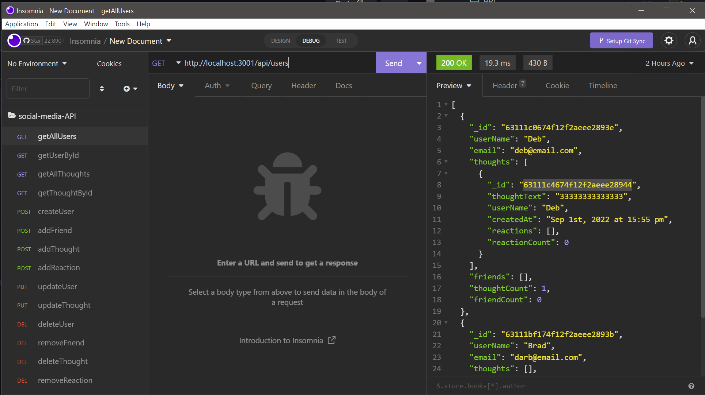

# <h1 align="center">social-media-API</h1>  

* <a href='https://powerful-journey-30948.herokuapp.com/'>https://powerful-journey-30948.herokuapp.com/</a>

## Table of Contents

- [Installation](#local-installation)
- [Usage](#usage)
- [Made With](#made-with)
- [Contributing](#contributing)

## Installation

* Run `npm init -y` from command line
* run `npm i` to install dependencies

Back to [top of page](# )

## Usage

* Run `npm start` from command line and test routes in Insomnia

## Insomnia Routes

*   `http://localhost:3001/api/users` 
*   `http://localhost:3001/api/users/:userId` 
*   `http://localhost:3001/api/thoughts` 
*   `http://localhost:3001/api/thoughts/:id` 
*   `http://localhost:3001/api/users` 
*   `http://localhost:3001/api/users/:useId/friends/:friendId` 
*   `http://localhost:3001/api/thoughts` 
*   `http://localhost:3001/api/thoughts/:thoughtId/reactions` 
*   `http://localhost:3001/api/users/:id` 
*   `http://localhost:3001/api/thoughts/:id` 
*   `http://localhost:3001/api/users/:id` 
*   `http://localhost:3001/api/users/:userId/friends/:frinedId` 
*   `http://localhost:3001/api/thoughts/:userId/:thoughtId` 
*   `http://localhost:3001/api/thoughts/:thoughtId/reactions/reactionId` 

Back to [top of page](# )

## Made With

* JavaScript
* Node.js
* Express.js
* Nodemon
* Mongoose
* MongoDB

## Made with ❤️ by:

* Brad Dunham

## Contributing

Feel free to submit an issue!

Back to [top of page](# )

