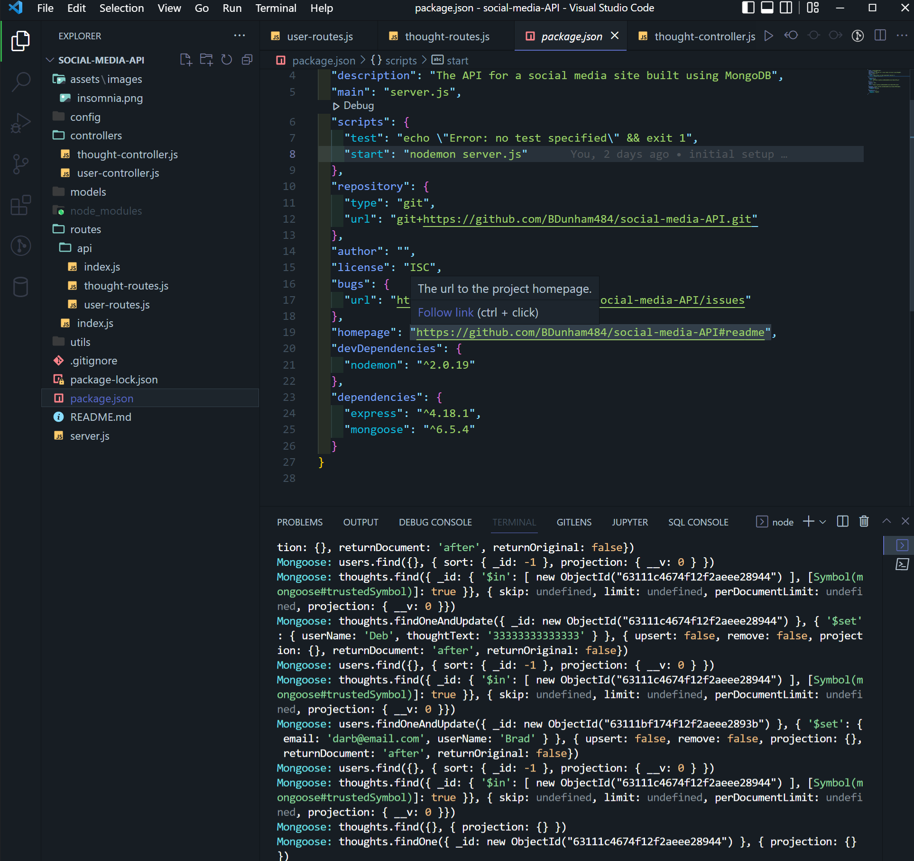

# <h1 align="center">social-media-API  </h1>

## Technologies 🤖

## Description: 

The API for a social media site using MongoDB.  CRUD methods can be run on users, thoughts, and reactions via routes and controllers in Insomnia. There is a User and Thought model.  Reactions are a subdocument of thoughts.  

* <a href="https://drive.google.com/file/d/1-3tLx2f7EOhikivrF1LMj2g-ZJccb1wo/view">Walkthrough Video: Part-1</a>
* <a href="https://drive.google.com/file/d/1OibIzO5kFVBNF-8q0txcEgYyu3Edl2Pf/view">Walkthrough Video: Part-2</a>

## Table of Contents

- [Installation](#installation)
- [Usage](#usage)
- [Insomnia Routes](#insomnia-routes)
- [Made With](#made-with)

## Installation

* Make sure MongoDB is installed locally
* Run `npm init -y` from command line
* run `npm i` to install dependencies

Back to [top of page](# )

## Usage

* Run `npm start` from command line and test routes in Insomnia

## Insomnia Routes

*   `http://localhost:3001/api/users`
*   `http://localhost:3001/api/users/:userId`
*   `http://localhost:3001/api/thoughts`
*   `http://localhost:3001/api/thoughts/:id`
*   `http://localhost:3001/api/users`
*   `http://localhost:3001/api/users/:userId/friends/:friendId`
*   `http://localhost:3001/api/thoughts`
*   `http://localhost:3001/api/thoughts/:thoughtId/reactions`
*   `http://localhost:3001/api/users/:id`
*   `http://localhost:3001/api/thoughts/:id`
*   `http://localhost:3001/api/users/:id`
*   `http://localhost:3001/api/users/:userId/friends/:frinedId`
*   `http://localhost:3001/api/thoughts/:userId/:thoughtId`
*   `http://localhost:3001/api/thoughts/:thoughtId/reactions/reactionId`

Back to [top of page](# )

## Made With

* JavaScript
* Node.js
* Express.js
* Nodemon
* Mongoose
* MongoDB

### Made with ❤️ by  Brad Dunham

Back to [top of page](# )

